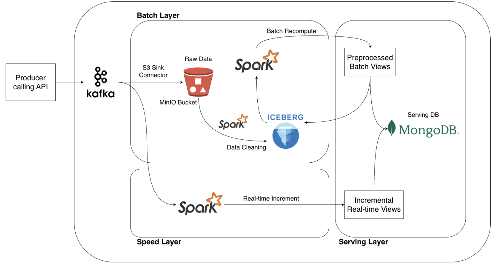

# 🌦️ Weather Monitoring and Forecasting System  
**Big Data Storage and Processing – Group 13**

## Checkpoint
[20-10-2025 Checkpoint](materials/checkpoint_slide_201025.pdf)

## 📘 Overview  
This project develops a **Weather Monitoring and Forecasting System** leveraging **Big Data technologies** to enhance the **accuracy, timeliness, and scalability** of meteorological analysis.  
It integrates multi-source environmental data (from satellites, sensors, IoT devices, and hydrological networks) to enable **real-time monitoring**, **predictive modeling**, and **disaster early warning** for climate adaptation.

---

## 🎯 Motivation  
Every year, the East Sea region faces numerous **tropical storms and typhoons** that threaten coastal and low-lying communities.  
Timely and accurate forecasting can significantly reduce human and economic losses by enabling **early preparation** and **preventive action**.

The system aims to:
- Monitor **real-time weather and hydrological conditions**  
- Forecast **rainfall, sunshine, storms, and floods**  
- Support **urban flood prediction** and **natural disaster early warning**  

---

## 🧩 System Architecture  

### 🔹 Architecture Model

- **Lambda Architecture** combining **Batch Processing** and **Stream Processing** for scalable and fault-tolerant data handling.  
- Data layers:  
  - **Batch Layer:** Processes large historical datasets for forecasting models.  
  - **Speed Layer:** Handles streaming data for real-time weather updates.  
  - **Serving Layer:** Merges batch and stream views for fast querying and visualization.

### 🔹 Core Technologies  
| Component | Technology | Description |
|------------|-------------|-------------|
| **Message Queue** | Apache Kafka | Streams real-time data from producers (sensors, APIs) to consumers. |
| **Distributed Storage** | MinIO | Stores raw and processed data with scalable S3-compatible storage. |
| **Table Format & Metadata** | Apache Iceberg | Manages schema evolution, ACID transactions, and time-travel snapshots. |
| **Batch Processing** | Apache Spark | Performs ETL and builds analytical batch views. |
| **Stream Processing** | Spark Structured Streaming | Consumes Kafka streams and produces real-time updates. |
| **Serving Layer** | MongoDB | Stores merged views for low-latency queries. |
| **Orchestration** | Kubernetes | Deploys and manages components with fault-tolerance and scalability. |

---

## 🌍 Data Sources  

| Category | Examples | Purpose |
|-----------|-----------|----------|
| **Rainfall Observation (Ground Stations)** | National meteorological & hydrological stations | Monitoring & validation |
| **Satellite Rainfall Data** | TRMM, GPM, CHIRPS | Prediction & spatial monitoring |
| **Water Level / Discharge** | DAHITI, GFMS, GloFAS | Flood warning |
| **Soil Moisture & Topography** | NASA DEM, LiDAR | Runoff modeling & flood mapping |
| **Land Cover / Land Use** | ESA WorldCover 2020 | Flood simulation |
| **Flood Inundation Maps** | MODIS, Sentinel-1 SAR, Copernicus GFM | Flood detection & validation |
| **Meteorological Data** | ERA5, NASA POWER | Weather modeling |
| **Urban & IoT Sensor Data** | Smart city flood sensors, Google Maps traffic | Early warning |
| **Regional Open Data** | Open Development Vietnam, UN-SPIDER | National and regional integration |

---

## 🧠 Expected Results  
- A **data processing pipeline** combining:
  - Batch processing for **weather forecasting**  
  - Stream processing for **real-time weather monitoring**  
- A **visual monitoring system** that integrates **big data analytics** and **visualization tools**  
- An advanced application supporting **weather observation, prediction**, and **climate change adaptation**

---

## 👥 Project Members  
**Group 13:**  
- Nguyễn Trí Thanh – 20225457  
- Phan Trần Việt Bách – 20225435  
- Lê Nhật Quang – 20225522  
- Nguyễn Hoàng Sơn – 20225525  
- Nguyễn Minh Quân – 20225520  

---

## 📄 License  
This project is developed for academic purposes under the **Big Data course project**.  
All datasets used are sourced from **public or open-access repositories**.
